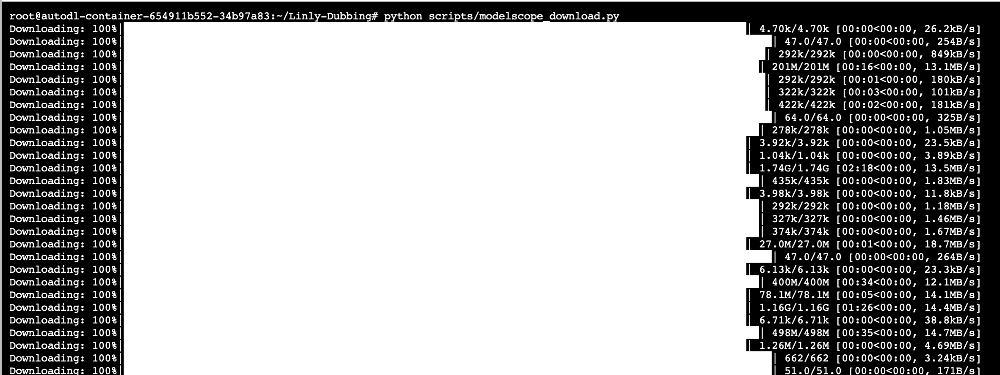
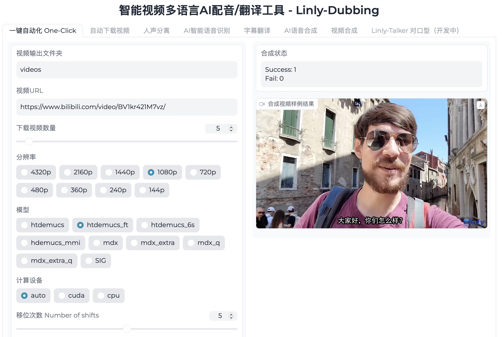

# Intelligent Multi-language AI Dubbing/Translation Tool - Linly-Dubbing — "AI Empowerment, Language Without Borders"

<div align="center">
<h1>Linly-Dubbing WebUI</h1>

[](https://github.com/Kedreamix/Linly-Dubbing)
<br>

[](https://colab.research.google.com/github/Kedreamix/Linly-Dubbing/blob/main/colab_webui.ipynb)
[](https://github.com/Kedreamix/Linly-Talker/blob/main/LICENSE)

[**English**](./README.md) | [**中文简体**](./README_zh.md)

</div>

---

<details open>
<summary>Table of Contents</summary>

<!-- TOC -->
- [Intelligent Multi-language AI Dubbing/Translation Tool - Linly-Dubbing — "AI Empowerment, Language Without Borders"](#intelligent-multi-language-ai-dubbingtranslation-tool---linly-dubbing--ai-empowerment-language-without-borders)
  - [Introduction](#introduction)
  - [TO DO LIST](#to-do-list)
  - [Examples](#examples)
  - [Installation and Usage Guide](#installation-and-usage-guide)
    - [Test Environment](#test-environment)
    - [1. Clone the Repository](#1-clone-the-repository)
    - [2. Install Dependencies](#2-install-dependencies)
    - [3. Configure Environment Variables](#3-configure-environment-variables)
    - [4. Run the Application](#4-run-the-application)
  - [Detailed Features and Technical Details](#detailed-features-and-technical-details)
    - [Automatic Video Download](#automatic-video-download)
    - [Vocal Separation](#vocal-separation)
      - [Demucs](#demucs)
      - [UVR5](#uvr5)
    - [AI Speech Recognition](#ai-speech-recognition)
      - [WhisperX](#whisperx)
      - [FunASR](#funasr)
    - [Large Language Model Translation](#large-language-model-translation)
      - [OpenAI API](#openai-api)
      - [Qwen](#qwen)
      - [Google Translate](#google-translate)
    - [AI-Powered Speech Synthesis](#ai-powered-speech-synthesis)
      - [Edge TTS](#edge-tts)
      - [XTTS](#xtts)
      - [CosyVoice](#cosyvoice)
      - [GPT-SoVITS](#gpt-sovits)
    - [Video Processing](#video-processing)
    - [Digital Human Lip-Sync Technology](#digital-human-lip-sync-technology)
  - [License](#license)
  - [References](#references)
  - [Star History](#star-history)

<!-- /TOC -->
</details>

## Introduction

`Linly-Dubbing` is an intelligent multi-language AI dubbing and translation tool inspired by [`YouDub-webui`](https://github.com/liuzhao1225/YouDub-webui) and further extended and optimized. We aim to offer diverse and high-quality dubbing options by integrating [`Linly-Talker`](https://github.com/Kedreamix/Linly-Talker)’s digital human lip-sync technology, creating a more natural multi-language video experience.

Leveraging cutting-edge AI technologies, `Linly-Dubbing` sets new standards in naturalness and accuracy for multi-language dubbing, making it ideal for international education, global content localization, and more. It helps teams extend their reach and share high-quality content worldwide.

Key features include:

- **Multi-language Support**: Offers dubbing and subtitle translation in Chinese and many other languages to meet global needs.
- **AI Speech Recognition**: Employs advanced AI for precise speech-to-text conversion and speaker recognition.
- **Large Language Model Translation**: Uses leading language models like GPT for fast and accurate translations, ensuring professional quality.
- **AI Voice Cloning**: Utilizes cutting-edge voice cloning to generate speech closely matching the original video's tone and emotion.
- **Digital Human Lip-Sync Technology**: Synchronizes dubbing with video visuals, enhancing realism and interactivity.
- **Flexible Upload and Translation**: Users can upload videos, choose translation languages, and standards, ensuring personalization and flexibility.
- **Regular Updates**: Continuously introduces the latest models to stay at the forefront of dubbing and translation technology.

Our mission is to provide seamless, high-quality multi-language dubbing and translation services, empowering content creators and businesses to thrive in global markets.

---

## TO DO LIST

- [x] Implement basic AI dubbing and smart translation features.
- [x] Integrate CosyVoice’s AI voice cloning for high-quality audio translation.
- [x] Add FunASR AI speech recognition algorithm with optimized Chinese support.
- [x] Utilize Qwen large language model for multi-language translation.
- [x] Develop Linly-Dubbing WebUI for easy one-click video generation with customizable parameters.
- [ ] Integrate UVR5 for voice/accompaniment separation and reverb removal, referencing GPTSoVITS.
- [ ] Improve voice cloning naturalness using GPTSoVITS for fine-tuning.
- [ ] Implement and optimize digital human lip-sync technology for better dubbing and visual coherence.

---

## Examples

| Original Video                                               | Linly-Dubbing                                                |
| ------------------------------------------------------------ | ------------------------------------------------------------ |
| <video src="https://github.com/user-attachments/assets/87ac52c1-0d67-4145-810a-d74147051026"> | <video src="https://github.com/user-attachments/assets/3d5c8346-3363-43f6-b8a4-80dc08f3eca4"> |

---

## Installation and Usage Guide

### Test Environment

This guide applies to the following test environments:

- Python 3.10, PyTorch 2.3.1, CUDA 12.1
- Python 3.10, PyTorch 2.3.1, CUDA 11.8

Follow the steps below to install and configure `Linly-Dubbing`. 

> [!NOTE]
>
> A Colab script is also available for an online experience: [Linly-Dubbing Colab](https://colab.research.google.com/github/Kedreamix/Linly-Dubbing/blob/main/colab_webui.ipynb).

### 1. Clone the Repository

First, clone the `Linly-Dubbing` repository to your local machine and initialize submodules.

```bash
# Clone the project to your local machine
git clone https://github.com/Kedreamix/Linly-Dubbing.git --depth 1

# Navigate to the project directory
cd Linly-Dubbing

# Initialize and update submodules like CosyVoice
git submodule update --init --recursive
```

### 2. Install Dependencies

Before proceeding, please create a new Python environment and install the required dependencies.

```bash
# Create a conda environment named 'linly_dubbing' and specify Python version 3.10
conda create -n linly_dubbing python=3.10 -y

# Activate the newly created environment
conda activate linly_dubbing

# Navigate to the project directory
cd Linly-Dubbing/

# Install the ffmpeg tool
# Install ffmpeg using conda
conda install ffmpeg==7.0.2 -c conda-forge
# Install ffmpeg using a domestic mirror
conda install ffmpeg==7.0.2 -c https://mirrors.tuna.tsinghua.edu.cn/anaconda/cloud/conda-forge/

# Upgrade pip to the latest version
python -m pip install --upgrade pip

# Change the PyPI source to speed up package downloads
pip config set global.index-url https://pypi.tuna.tsinghua.edu.cn/simple
```

Depending on your CUDA version, install PyTorch and related libraries using the following commands:

```bash
# For CUDA 11.8
pip install torch==2.3.1 torchvision==0.18.1 torchaudio==2.3.1 --index-url https://download.pytorch.org/whl/cu118

# For CUDA 12.1
pip install torch==2.3.1 torchvision==0.18.1 torchaudio==2.3.1 --index-url https://download.pytorch.org/whl/cu121
```

If you prefer to install PyTorch via conda, you can use the following commands:

```bash
# For CUDA 11.8
conda install pytorch==2.3.1 torchvision==0.18.1 torchaudio==2.3.1 pytorch-cuda=11.8 -c pytorch -c nvidia

# For CUDA 12.1
conda install pytorch==2.3.1 torchvision==0.18.1 torchaudio==2.3.1 pytorch-cuda=12.1 -c pytorch -c nvidia
```

> [!NOTE]
>
> The installation process is very slow.

Next, install the remaining project dependencies:

```bash
# Install the required Python packages for the project
# pynini is required by WeTextProcessing, so use conda to install it as it works across all platforms.
conda install -y pynini==2.1.5 -c conda-forge
# -c https://mirrors.tuna.tsinghua.edu.cn/anaconda/cloud/conda-forge/

pip install -r requirements.txt
# Install dependencies for submodules
pip install -r requirements_module.txt
```

> [!TIP]
>
> If you encounter an error during installation that says "Could not load library libcudnn_ops_infer.so.8," follow these steps to fix it:
>
> ```bash
> # Set LD_LIBRARY_PATH to include the correct cuDNN library path
> export LD_LIBRARY_PATH=`python3 -c 'import os; import torch; print(os.path.dirname(os.path.dirname(torch.__file__)) +"/nvidia/cudnn/lib")'`:$LD_LIBRARY_PATH
> ```
>

### 3. Configure Environment Variables

Before running the program, you need to configure the necessary environment variables. In the root directory of the project, create a `.env` file by renaming `env.example` and filling in the following variables:

- `OPENAI_API_KEY`: Your OpenAI API key, usually formatted as `sk-xxx`.
- `MODEL_NAME`: The name of the model you are using, such as `gpt-4` or `gpt-3.5-turbo`.
- `OPENAI_API_BASE`: If you are using a self-hosted OpenAI model, provide the corresponding API base URL here.
- `HF_TOKEN`: Your Hugging Face API token, used to access and download models.
- `HF_ENDPOINT`: A custom Hugging Face endpoint, which can be specified if you encounter issues with model downloading.
- `APPID` and `ACCESS_TOKEN`: Credentials for using the Bytedance TTS engine.
- `BAIDU_API_KEY` and `BAIDU_SECRET_KEY`: Used for Baidu's Ernie Bot API.

> [!NOTE]
>
> In most cases, you only need to configure `MODEL_NAME` and `HF_TOKEN`.
>
> By default, `MODEL_NAME` is set to `Qwen/Qwen1.5-4B-Chat`, so you do not need to configure the `OPENAI_API_KEY`.

> [!TIP]
>
> Since the performance of large models can be limited under normal circumstances, it is recommended to use larger models or better APIs. I personally recommend choosing OpenAI's API. If cost is a concern, you can try Baidu's Ernie Bot API, which offers free API access. Simply apply for the API and add it to your environment variables: https://console.bce.baidu.com/qianfan/ais/console/applicationConsole/application/v1.
>
> You can obtain your `HF_TOKEN` from [Hugging Face](https://huggingface.co/settings/tokens). If you wish to use the **speaker separation feature**, make sure to request access to [pyannote/speaker-diarization-3.1](https://huggingface.co/pyannote/speaker-diarization-3.1). Otherwise, you can opt not to enable this feature.

### 4. Run the Application

Before launching the application, run the following commands to automatically download the required models (including Qwen, XTTSv2, and faster-whisper-large-v3):

```bash
# For Linux
bash scripts/download_models.sh

# For Windows
python scripts/modelscope_download.py
# Download the wav2vec2_fairseq_base_ls960_asr_ls960.pth file and place it in the models/ASR/whisper folder
wget -nc https://download.pytorch.org/torchaudio/models/wav2vec2_fairseq_base_ls960_asr_ls960.pth \
    -O models/ASR/whisper/wav2vec2_fairseq_base_ls960_asr_ls960.pth
```



Once the download is complete, launch the WebUI interface using the following command:

```bash
python webui.py
```

After starting, you will see an interface like the one below. You can open [http://127.0.0.1:6006](http://127.0.0.1:6006) to explore the application:




## Detailed Features and Technical Details

### Automatic Video Download

**yt-dlp** is a powerful open-source command-line tool designed for downloading video and audio from YouTube and other websites. This tool offers a wide range of parameter options, allowing users to customize download behavior to their needs. Whether choosing specific formats, resolutions, or extracting audio, yt-dlp provides flexible solutions. It also supports extensive post-processing features, such as automatically adding metadata and renaming files. For more details on parameters and usage, refer to the [yt-dlp official repository](https://github.com/yt-dlp/yt-dlp).

### Vocal Separation

#### Demucs 

**Demucs** is an advanced sound separation model developed by the Facebook research team, designed to separate different sound sources from mixed audio. Although its architecture is simple, Demucs is powerful enough to isolate instruments, voices, and background noise, making it easier for users to perform post-processing and editing. Its user-friendly design has made it a preferred tool for many audio processing applications, including music production and post-production in films. More information can be found on the [Demucs project page](https://github.com/facebookresearch/demucs).

#### UVR5

**UVR5 (Ultimate Vocal Remover)** is one of the best tools for vocal and accompaniment separation. It excels in generating high-quality accompaniments and vocal extractions, outperforming tools like RX9, RipX, and SpectraLayers 9. The extracted accompaniments are nearly indistinguishable from the original stereo tracks, and UVR5 is both open-source and free. Find the source code at: [https://github.com/Anjok07/ultimatevocalremovergui](https://github.com/Anjok07/ultimatevocalremovergui).

WebUI reference: [https://github.com/RVC-Boss/GPT-SoVITS/tree/main/tools/uvr5](https://github.com/RVC-Boss/GPT-SoVITS/tree/main/tools/uvr5)

Model weights reference: [https://huggingface.co/lj1995/VoiceConversionWebUI/tree/main/uvr5_weights](https://huggingface.co/lj1995/VoiceConversionWebUI/tree/main/uvr5_weights)

### AI Speech Recognition

#### WhisperX

**WhisperX** is an extension of OpenAI's Whisper speech recognition system, specifically designed for generating and aligning subtitles for videos. Unlike traditional speech recognition systems, WhisperX not only accurately transcribes spoken content into text but also aligns it with video frames to generate timestamped subtitle files. This precise alignment makes video editing and subtitle generation more efficient and intuitive. WhisperX also supports multi-speaker recognition, providing detailed speaker information for richer, easier-to-understand subtitles.

#### FunASR

**FunASR** is a comprehensive speech recognition toolkit offering a wide range of speech processing features, including Automatic Speech Recognition (ASR), Voice Activity Detection (VAD), punctuation restoration, language modeling, speaker verification, speaker separation, and multi-speaker dialogue recognition. FunASR is particularly optimized for Chinese speech and offers pre-trained models with easy fine-tuning interfaces. It’s a significant tool in the field of speech recognition, widely used in voice assistants, automatic subtitle generation, and more. For more information, visit the [FunASR project](https://github.com/alibaba-damo-academy/FunASR).

### Large Language Model Translation

#### OpenAI API

`Linly-Dubbing` uses OpenAI's large language models, such as GPT-4 and GPT-3.5-turbo, to perform high-quality translations via API. OpenAI's models are renowned for their natural language understanding and high-precision text generation capabilities, commonly used in tasks like dialogue generation and text analysis. You can find more details about the models and usage in the [OpenAI official documentation](https://platform.openai.com/docs/models).

#### Qwen

**Qwen** is a localized large language model that supports multi-language translation. Although its performance may not match OpenAI's top models, its open-source nature and local execution make it a cost-effective option. Qwen is capable of handling text translations across various languages and serves as a powerful open-source alternative. More details can be found on the [Qwen project page](https://github.com/QwenLM/Qwen).

#### Google Translate

As a supplement to the translation features, `Linly-Dubbing` also integrates [Google Translate](https://py-googletrans.readthedocs.io/en/latest/). Google Translate offers broad language support and good translation quality, making it suitable for quickly obtaining approximate translations.

### AI-Powered Speech Synthesis

#### Edge TTS

**Edge TTS** is a high-quality text-to-speech conversion service provided by Microsoft. It supports multiple languages and voice styles, capable of generating natural and fluent voice output. With Edge TTS, `Linly-Dubbing` can generate high-quality speech from text, making content more lively and understandable. For more information, refer to the [Edge TTS official documentation](https://github.com/rany2/edge-tts).

#### XTTS

**Coqui XTTS** is an advanced deep learning text-to-speech toolkit focused on voice cloning and multi-language speech synthesis. XTTS can achieve voice cloning using brief audio snippets and generate realistic speech output. It offers a variety of pre-trained models and development tools, supporting training and fine-tuning of new models. Users can explore XTTS's capabilities online at [Hugging Face](https://huggingface.co/spaces/coqui/xtts) or visit the [official GitHub repository](https://github.com/coqui-ai/TTS) for more technical details.

- Try XTTS online: [Hugging Face](https://huggingface.co/spaces/coqui/xtts)
- Official GitHub repository: [Coqui TTS](https://github.com/coqui-ai/TTS)

#### CosyVoice

**CosyVoice** is a multi-language speech understanding and synthesis model developed by Alibaba's Tongyi Lab, supporting Chinese, English, Japanese, Cantonese, Korean, and more. CosyVoice is trained on over 150,000 hours of voice data and enables high-quality speech synthesis and cross-lingual voice cloning. It excels at generating natural and coherent speech across languages, with support for one-shot voice cloning, needing only 3 to 10 seconds of original audio to generate a similar voice. For more information and model details, visit the [CosyVoice project](https://github.com/FunAudioLLM/CosyVoice).

Main features and characteristics:

1. **Multi-language support**: Handles speech synthesis tasks in various languages.
2. **Multi-style speech synthesis**: Controls the emotion and tone of speech through commands.
3. **Streaming inference support**: Future plans include real-time streaming inference support.

#### GPT-SoVITS

Thanks to the contributions of the open-source community, AI speech synthesis also benefits from the open-source voice cloning model `GPT-SoVITS`. **GPT** is a transformer-based natural language processing model with strong text generation capabilities, while **SoVITS** is a deep learning-based voice conversion technology capable of converting one person's voice into another’s. By combining these two technologies, **GPT-SoVITS** can generate highly realistic speech that matches the given text content.

The project can be found at [https://github.com/RVC-Boss/GPT-SoVITS](https://github.com/RVC-Boss/GPT-SoVITS). Key features include:

1. **Zero-shot Text-to-Speech (TTS):** Input a 5-second voice sample to experience instant text-to-speech conversion.
2. **Few-shot TTS:** Fine-tune the model with just 1 minute of training data to improve voice similarity and realism.
3. **Cross-lingual support:** Inference across languages different from the training dataset, currently supporting English, Japanese, and Chinese.
4. **WebUI tools:** Integrated tools include voice accompaniment separation, automatic dataset splitting, Chinese automatic speech recognition (ASR), and text annotation to help beginners create training datasets and GPT/SoVITS models.

### Video Processing

In terms of video processing, `Linly-Dubbing` provides robust functionality support. Users can easily add subtitles, insert background music, adjust background music volume, and modify overall playback speed. With these features, users can customize video content to make it more engaging and personalized.

### Digital Human Lip-Sync Technology

Inspired by `Linly-Talker`, this project focuses on digital human lip-sync technology. By combining advanced computer vision and speech recognition technologies, `Linly-Talker` allows digital characters' lip movements to match voiceovers precisely, achieving highly natural synchronization. This technology is not only applicable to animated characters but can also be used in scenarios such as virtual presenters or educators in instructional videos. `Linly-Talker` enhances digital character performance with accurate lip-sync and vivid facial expressions, providing a more immersive experience for the audience. This advanced digital human lip-sync technology significantly improves the professionalism and viewing experience of video content. For more information, refer to [https://github.com/Kedreamix/Linly-Talker](https://github.com/Kedreamix/Linly-Talker).

---

## License

> [!Caution]
>
> When using this tool, please comply with relevant laws, including copyright, data protection, and privacy laws. Do not use this tool without permission from the original author and/or rights holder.

`Linly-Dubbing` follows the Apache License 2.0. When using this tool, please comply with relevant laws, including copyright, data protection, and privacy laws. Do not use this tool without permission from the original author and/or rights holder.

---

## References

In developing this project, I referenced and drew inspiration from several outstanding open-source projects and related resources. Special thanks to the developers and contributors of these projects and the open-source community. Below are the main projects we referenced:

- [YouDub-webui](https://github.com/liuzhao1225/): Provides a feature-rich web interface for downloading and processing YouTube videos, from which we drew much inspiration and technical implementation details.

- [Coqui TTS](https://github.com/coqui-ai/TTS)
- [Qwen](https://github.com/QwenLM/Qwen)
- [FunASR](https://github.com/alibaba-damo-academy/FunASR)
- [CosyVoice](https://github.com/FunAudioLLM/CosyVoice)
- [Linly-Talker](https://github.com/Kedreamix/Linly-Talker)

---

## Star History


